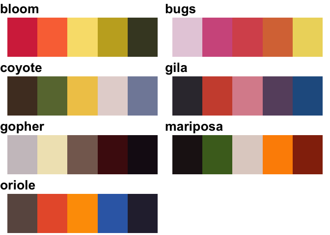
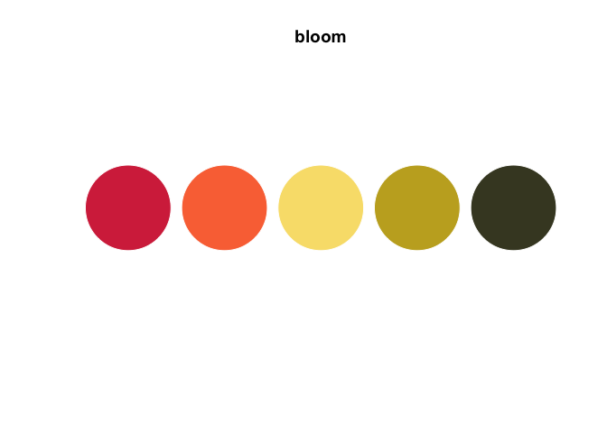
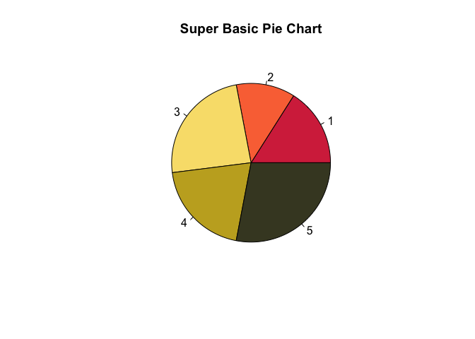
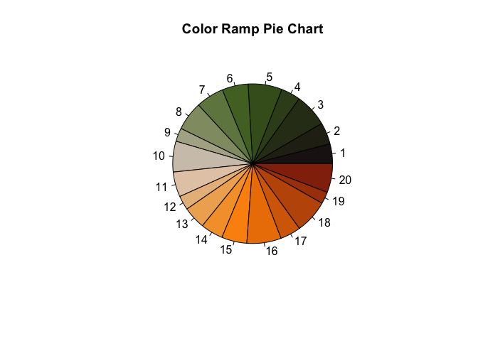
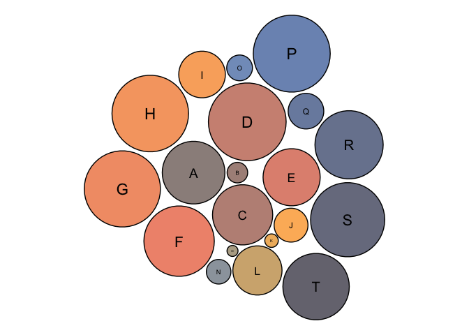

<!-- README.md is generated from README.Rmd. Please edit that file -->

# saguaRo

Have you ever wanted your data visualizations to represent the beauty of
Arizona? Maybe you haven’t yet realized this desire, but this color
palette package is perfect for you! This is a fun project for me that I
put together to feature the many colors of the beautiful Arizona desert.
Enjoy!

For more examples and beautiful Arizona photos visit
<https://sborrego.github.io/saguaRo/>

## Installation

<!-- You can install the released version of saguaRo from [CRAN](https://CRAN.R-project.org) with: -->
<!-- ``` r -->
<!-- install.packages("saguaRo") -->
<!-- ``` -->

You can install the development version from
[GitHub](https://github.com/) with:

``` r
# install.packages("devtools")
devtools::install_github("sborrego/saguaRo")
```

## Colors

Welcome to the desert! These are the color palettes and names available
in `saguaRo`.

``` r
library(saguaRo)
all_saguaro()
```



Forgot the colors in the color palette of your choice? No problem! Just
use the function `display_saguaro()` with any color palette name and see
the beauty of the desert appear before your eyes!

``` r
library(saguaRo)
display_saguaro("bloom")
```



### Use

But how do you even use it? Use the function `saguaro()` with the
palette name and optionally the number of colors you would like.

``` r
library(saguaRo)

n_list <- c(4, 3, 6, 5, 7)

pie(n_list, 
    main = "Super Basic Pie Chart", 
    col = saguaro("bloom", length(n_list)))
```



Take your data visualizations even futher by extending the vibrant
colors of `saguaRo` with the essential
[`RColorBrewer`](https://www.r-graph-gallery.com/38-rcolorbrewers-palettes.html)
package.

``` r
library(saguaRo)
library(RColorBrewer)

num_data <- runif(20, 3, 12)

pie(num_data,
    main = "Color Ramp Pie Chart",
    col = colorRampPalette(saguaro("mariposa"))(20))
```



Need to see your color palette of choice in action ASAP? Use
`plot_saguaro()` with any color palette name and plot selected boxplot
(box), density (density), dotplot (gradient), or circular packing chart
(circle).

``` r
plot_saguaro("oriole", "circle")
```



<!-- You'll still need to render `README.Rmd` regularly, to keep `README.md` up-to-date. `devtools::build_readme()` is handy for this. You could also use GitHub Actions to re-render `README.Rmd` every time you push. An example workflow can be found here: <https://github.com/r-lib/actions/tree/master/examples>. -->
<!-- You can also embed plots, for example: -->
<!-- ```{r pressure, echo = FALSE} -->
<!-- plot(pressure) -->
<!-- ``` -->
<!-- In that case, don't forget to commit and push the resulting figure files, so they display on GitHub and CRAN. -->
