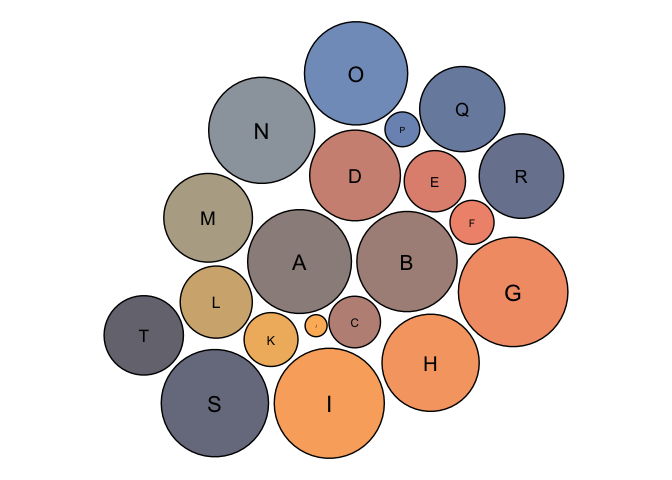

<!-- README.md is generated from README.Rmd. Please edit that file -->

# saguaRo

Have you ever wanted your data visualizations to represent the beauty of
Arizona? Maybe you haven’t yet realized this desire, but this color
palette package is perfect for you! This is a fun project for me that I
put together to feauture the many colors of the beautiful Arizona
desert. Enjoy!

<!-- badges: start -->
<!-- badges: end -->
<!-- The goal of saguaRo is to ... -->
<!-- ## Installation -->
<!-- You can install the released version of saguaRo from [CRAN](https://CRAN.R-project.org) with: -->
<!-- ``` r -->
<!-- install.packages("saguaRo") -->
<!-- ``` -->

This package is currently progress - errors may occur!  
You can install the development version from
[GitHub](https://github.com/) with:

``` r
# install.packages("devtools")
devtools::install_github("sborrego/saguaRo")
```

## Colors

Welecome to the desert! These are the color palettes and names available
in saugaRo.

### Use

Forgot the colors in the color palette of your choice? No problem!

``` r
library(saguaRo)
display_saguaro("bloom")
```


Need to see the your color palette of choice in action?

``` r
plot_saguaro("bugs", "box")
```



<!-- You'll still need to render `README.Rmd` regularly, to keep `README.md` up-to-date. `devtools::build_readme()` is handy for this. You could also use GitHub Actions to re-render `README.Rmd` every time you push. An example workflow can be found here: <https://github.com/r-lib/actions/tree/master/examples>. -->
<!-- You can also embed plots, for example: -->
<!-- ```{r pressure, echo = FALSE} -->
<!-- plot(pressure) -->
<!-- ``` -->
<!-- In that case, don't forget to commit and push the resulting figure files, so they display on GitHub and CRAN. -->
