Welcome to the desert! Arizona is full of beauty from its remarkable sunsets to the resilient wildlife. No where better captures this beauty than the [Arizona-Sonora Desert Museum](https://www.desertmuseum.org). Using their amazing photos, I have curated some of my favorite images and their corresponding color palettes. Each color palatte inspiring photo is displayed below next to an example data visualization. You can download [saguaRo](https://github.com/sborrego/saguaRo) from GitHub and start using the colors of the desert to liven up your data today! ENJOY

### Bloom

**Source**: [Arizona-Sonora Desert Museum Facebook](https://www.facebook.com/desertmuseum/photos/10156459866659315)  
**Photo Credit**: Unknown

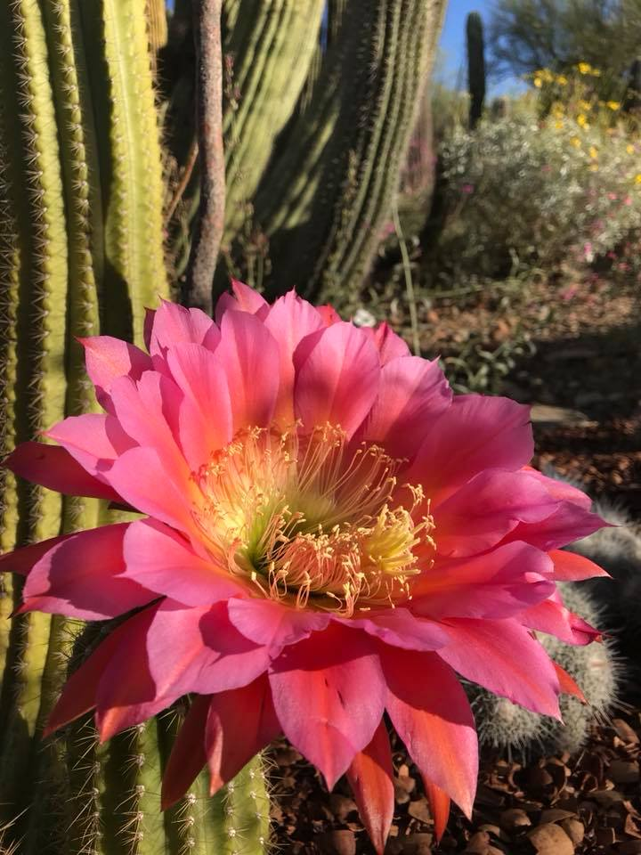 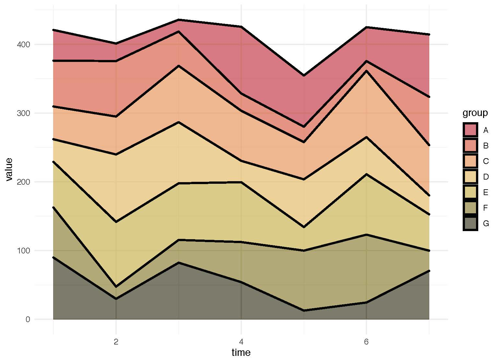
 

### Bugs

**Source**: [Arizona-Sonora Desert Museum Facebook](https://www.facebook.com/desertmuseum/photos/a.414296809314/10155946974709315/?type=3&theater)  
**Photo Credit**: Lauren Nichols

 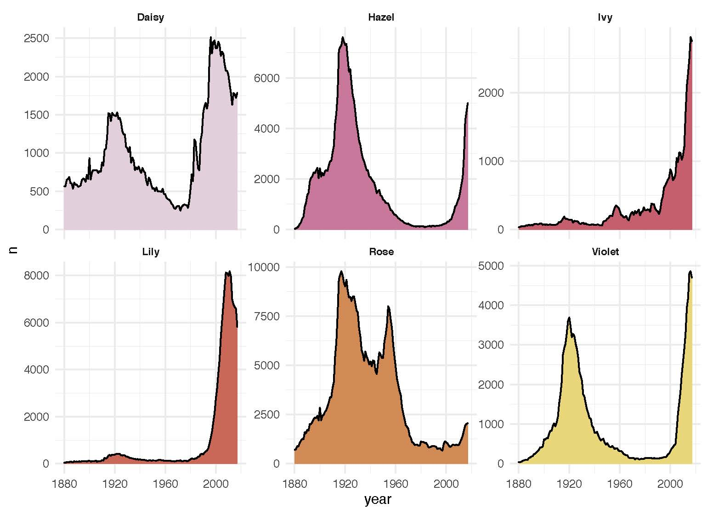

### Coyote

**Source**: [Arizona-Sonora Desert Museum Facebook](https://www.facebook.com/desertmuseum/photos/fpp.39379799314/10155961909294315/?type=3&theater)  
**Photo Credit**: Jay Pierstorff

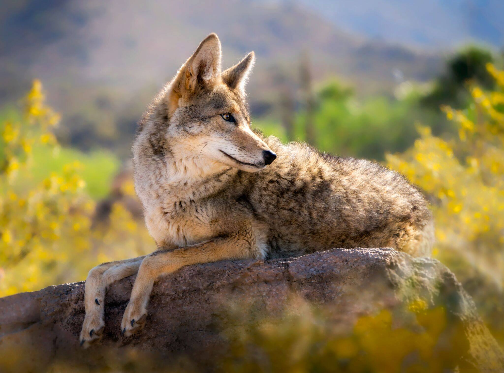 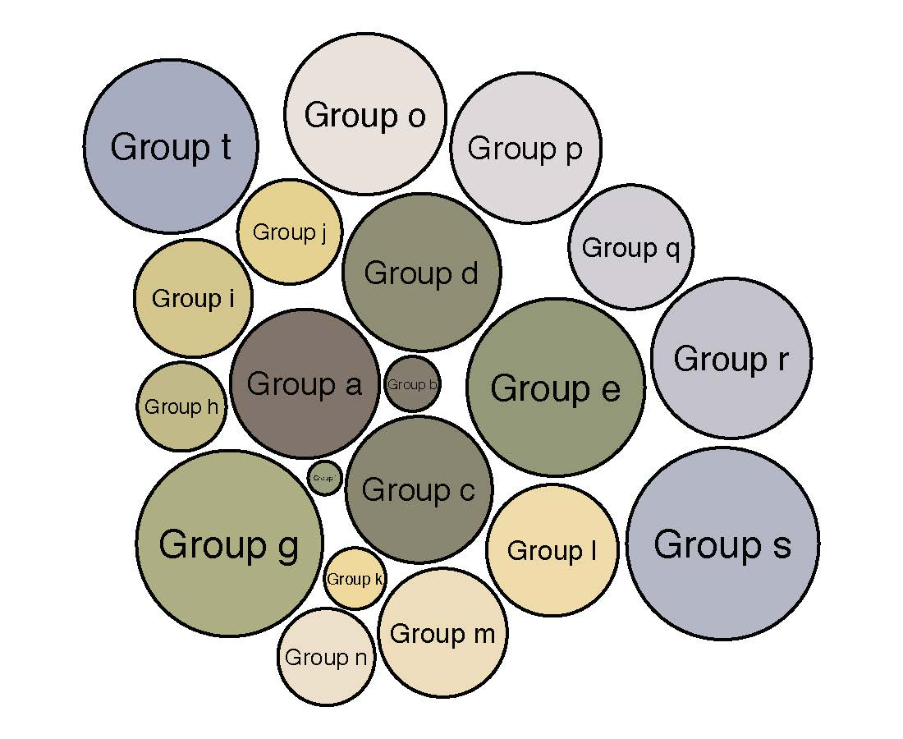

### Gila

**Source**: [Arizona-Sonora Desert Museum Facebook](https://www.facebook.com/desertmuseum/photos/a.414296809314/10155933673404315/?type=3&theater)  
**Photo Credit**: Jay Pierstorff

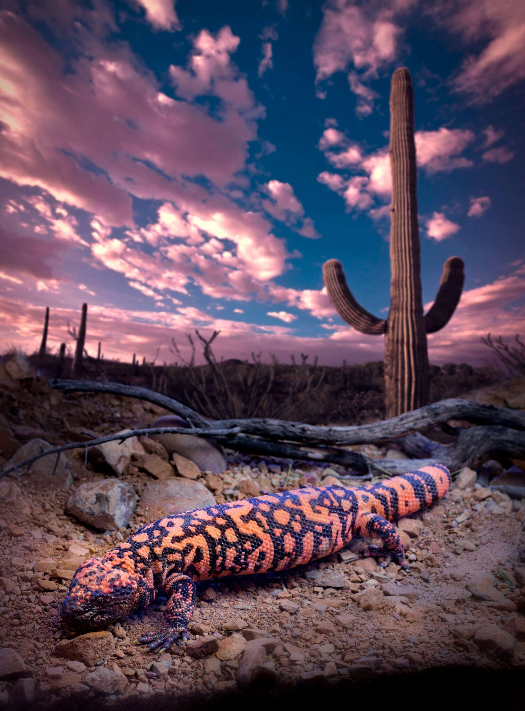 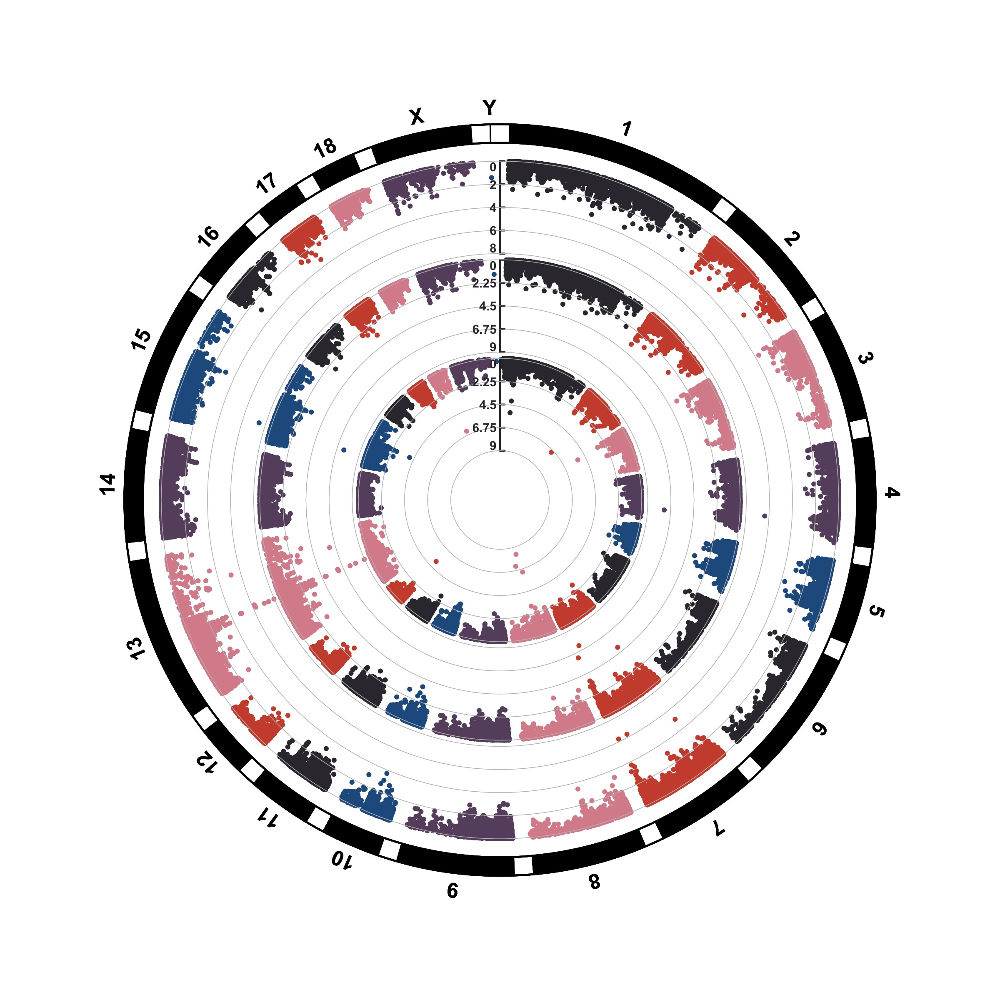

### Gopher

**Source**: [Arizona-Sonora Desert Museum Facebook](https://www.facebook.com/desertmuseum/photos/a.414296809314/10158124433149315/)  
**Photo Credit**: Rodolfo Vega (Instagram: @rodolfovegafoto)

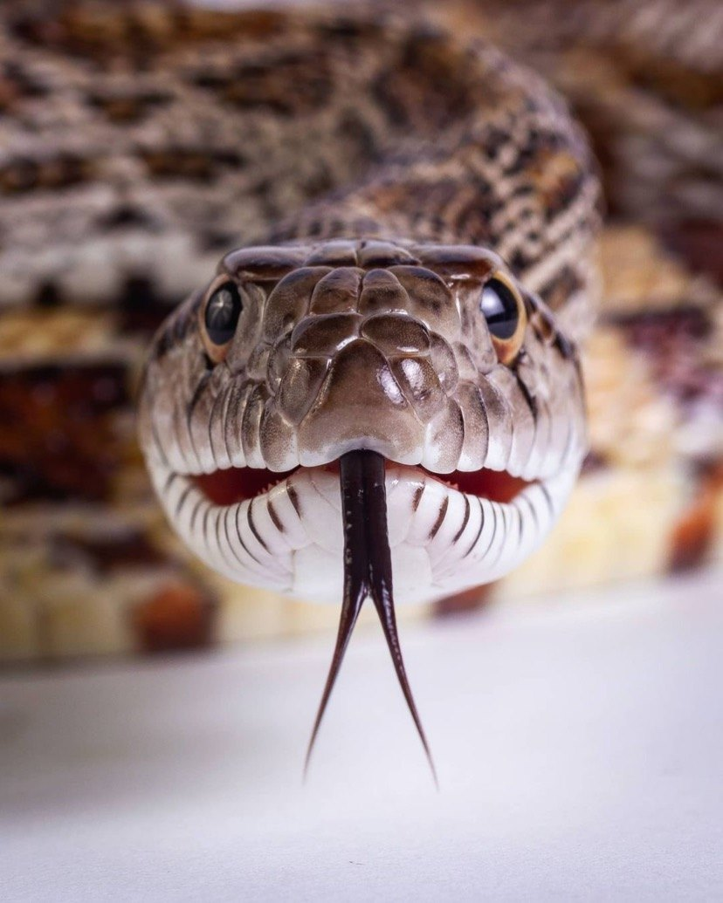 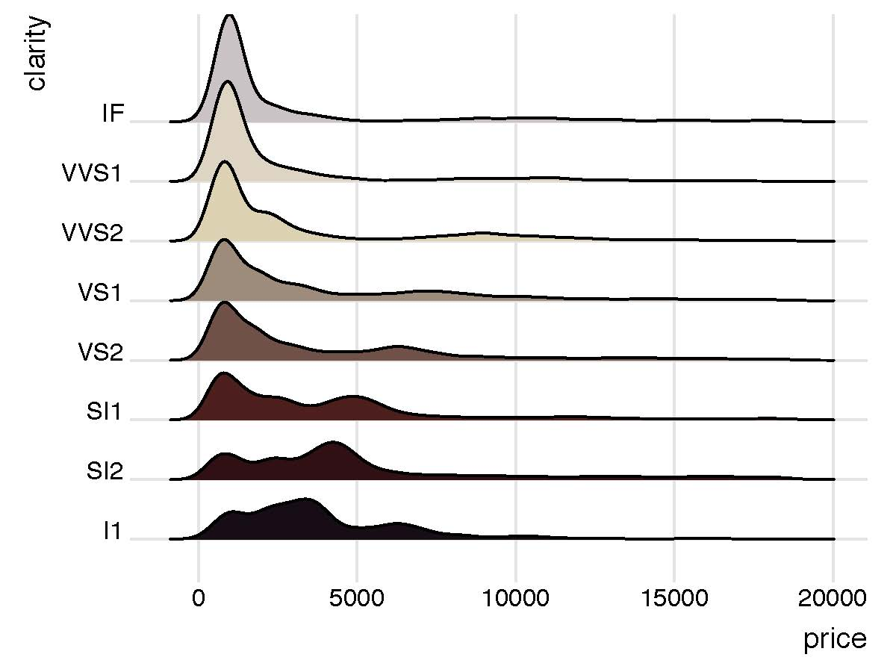

### Mariposa

**Source**: [Arizona-Sonora Desert Museum Facebook](https://www.facebook.com/desertmuseum/photos/a.414296809314/10155180359064315/?type=3&theater)  
**Photo Credit**: Rhonda Spencer  
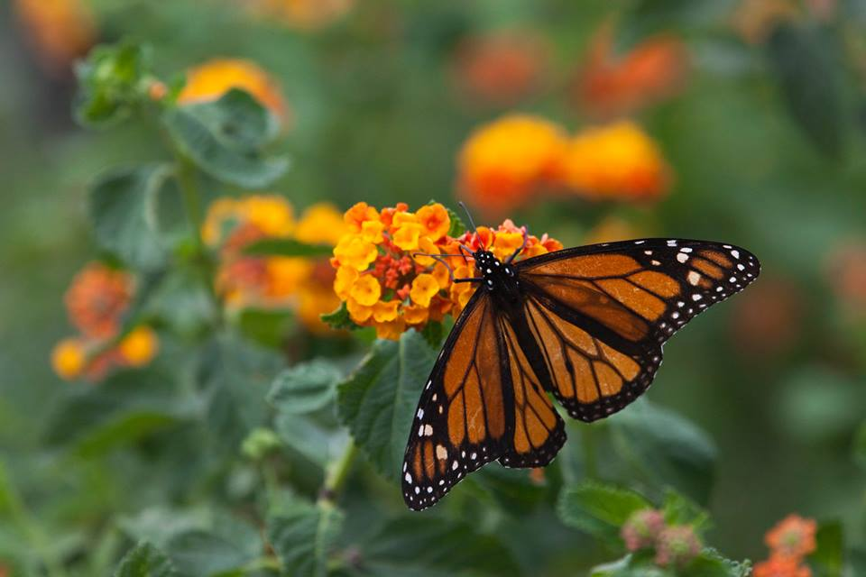 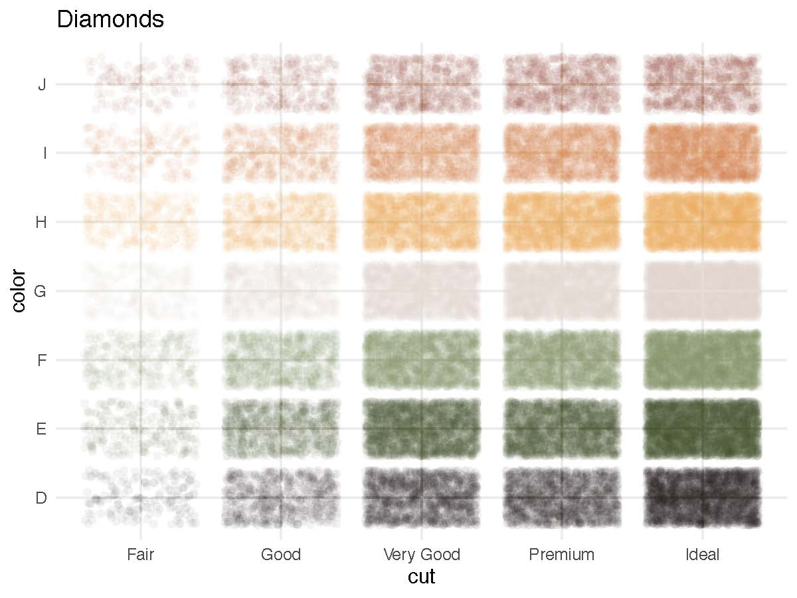

### Oriole

**Source**: [Arizona-Sonora Desert Museum Facebook](https://www.facebook.com/desertmuseum/photos/a.414296809314/10156441631724315/?type=3&theater)  
**Photo Credit**: Jay Pierstroff

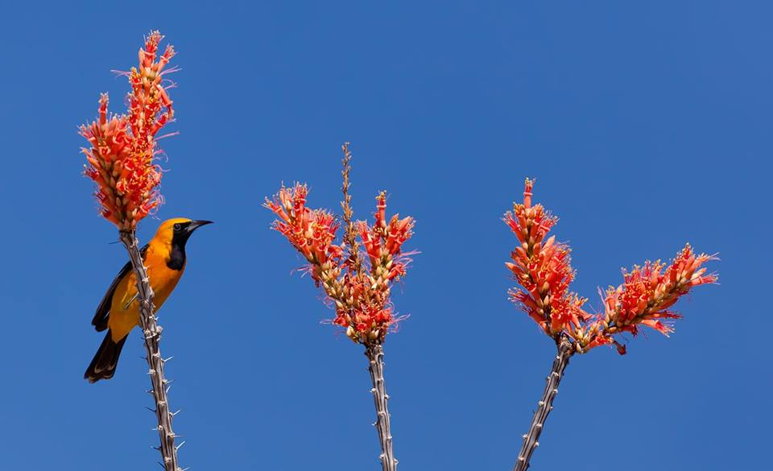 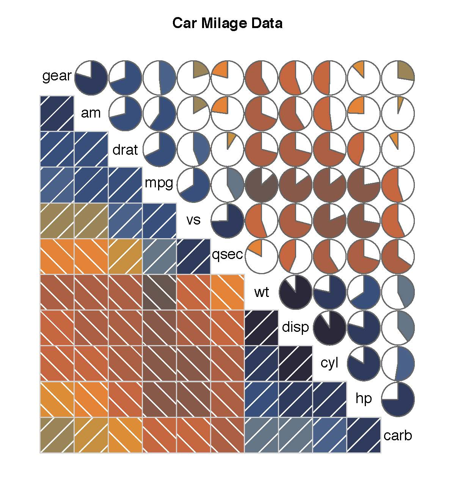
